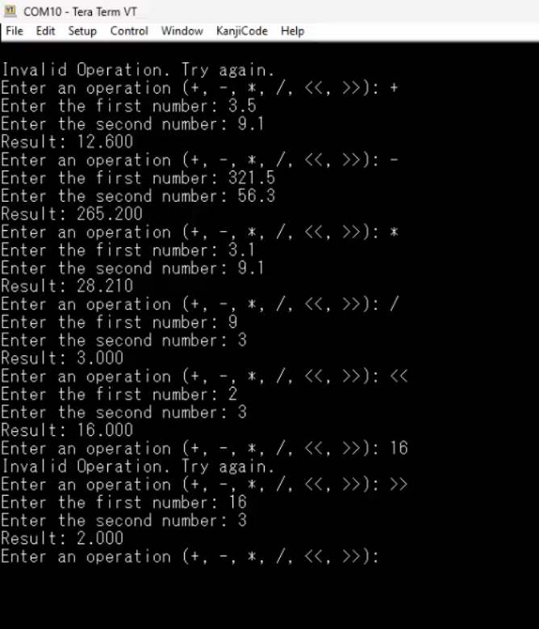

# ECE 425 Project - UART Calculator
This is the final project in ECE 425 - Microprocessor Systems, offered in CSU Northridge.

Created By:
- Mustakimur Rahman
- Sina Khodabakhshi

Professor: 
- Aaron Nanas

# Introduction
Our final project was a UART-based Calculator, designed to facilitate user interaction through a terminal window that communicates with the TI TIVA board. This project aimed to create a user-friendly interface for performing basic arithmetic operations, showcasing the capabilities of embedded systems in a practical application.

# Results and Demonstration

Video Link : [Link](https://drive.google.com/file/d/1a86rCPnWs0EeaC7iIgkb0KaDtmOQkIPp/view?usp=sharing)

# Background and Methodology
In developing our UART-based Calculator, we applied key concepts from embedded systems, including real-time data processing and serial communication. The primary outcome was a functional calculator capable of handling addition, subtraction, multiplication, division and logical shifting  while maintaining a responsive user interface. We utilized the TM4C123GH6PM microcontroller, focusing on the following peripherals:
- SysTick Timer: This was used to introduce delays in the program, allowing for effective management of user input and ensuring smooth operation.
- UART Module: The UART module facilitated serial communication between the TI TIVA board and the TeraTerm software terminal, enabling users to input commands and receive results seamlessly.
# Functional Block Diagram

# Table of Components Used
| Part | QTY | Price ($) | Link |
| --- | --- | --- | --- |
| Tiva C Series TM4C123G LaunchPad | 1 | $16.99 per unit | [Product Link](https://www.ti.com/tool/EK-TM4C123GXL) 

# Table of Pinout Used
- No Pinouts used for this project.
